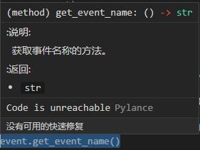

# 第二章：基础插件编写指南第二节———听得见，说得出
本节中，将会初步涉及 `事件响应器` 与 `事件处理` ，但这只是其冰山一角，在后续的教程中将会详细补充。但首先我们需要知道，它们是什么。

## 事件响应器与事件处理
在上一节中，我们将插件比作nonebot的 “意识” ，而意识我们可以简单的理解为由无数 “条件反射” 所组成的（说法并不严谨，仅作为比喻）。那么，事件响应器就是 “条件反射” 中的 “条件” 、事件处理就是 “反射” 。
换言之，事件响应器是对于机器人所收到的信息进行检验，满足我们预设的 “条件” 之后就会将信号传导nonebot，进一步去触发事件处理流程的开始，也就是进行 “反射” 。

>这部分东西比较多，而且一般来说是按需取用，所以在此不过多介绍，具体可以去查看官方文档，也可以看看现在还没写完的第三章第一节（目前仅会上传github）


## 开始编写第一个插件（今日人品）
作为演示，我们将编写一个占卜今日运气的插件。

### 该插件的执行流程
也就是这个插件会响应什么样的信息，对于这样的信息做出什么样的反应。
很多新手在群内对如何实现某种功能进行提问的时候，常常无法正确的表述自己的想法，因此导致浪费了很多时间，还得不到答案。
因此，在编写一个较为复杂的插件的时候，可以先用流程图来对插件进行设计，然后再着手编写代码。

我们这个插件的功能十分简单，检测用户发送的“jrrp”或“今日人品”，然后随机生成一个1-100的数字作为人品值发回给用户，并@用户，同一天内该数字理应为同一值。

### 代码部分

```python
import random
from datetime import date
from nonebot.plugin import on_keyword
from nonebot.adapters.onebot.v11 import Bot, Event
from nonebot.adapters.onebot.v11.message import Message

def luck_simple(num):
    if num < 18:
        return '大吉'
    elif num < 53:
        return '吉'
    elif num < 58:
        return '半吉'
    elif num < 62:
        return '小吉'
    elif num < 65:
        return '末小吉'
    elif num < 71:
        return '末吉'
    else:
        return '凶'
    

jrrp = on_keyword(['jrrp','今日人品'],priority=50)
@jrrp.handle()
async def jrrp_handle(bot: Bot, event: Event):
    rnd = random.Random()
    rnd.seed(int(date.today().strftime("%y%m%d")) + int(event.get_user_id()))
    lucknum = rnd.randint(1,100)
    await jrrp.finish(Message(f'[CQ:at,qq={event.get_user_id()}]您今日的幸运指数是{lucknum}/100（越低越好），为"{luck_simple(lucknum)}"'))
```

### 事件响应器
因为这个插件需要检测多个关键词，因此我们可以选择 `on_keyword()` 这个事件响应器，
`jrrp = on_keyword(['jrrp','今日人品'],priority=50)`
这样，我们就注册好了一个可以对这两个关键词进行响应的事件响应器，不过要注意的的是，这个响应器在用户发送的消息中，只要找到了这个关键词就会触发，因此对于一些常用语请务必慎重设置。
###### priority
其中`priority=50`是指这个事件响应器的优先度为50，类似于“接口跃点”，优先度的数字越低，则优先度越高，也越早可以对消息进行匹配。

在nonebot中，这个字段的默认值是优先度能设置的最小值`1`，也就是**最优先**。

nonebot的事件处理中有事件阻断机制，也就是说，在事件向优先度较低的响应器传递的过程中，一旦被匹配到，并且被阻断了，那么后续的事件响应器将不会再接收到这个事件。

举个例子，假设一群人去食堂打饭，如果每种菜的量只有一份，那么排在队前面的人可以更早的打饭，能打的菜也越多，而排在后面的只能挑前面的人不要的菜了。因此在设置 `priority` 的时候务必慎重。

### 事件处理
>这部分涉及一些语法糖，因此作为小白暂时还不需要理解，按照格式照抄就行了，这部分的详细讲解也会在之后进行

首先，我们可以用刚刚注册的事件响应器来对一个异步函数进行装饰，就像这样。
```python
@jrrp.handle()
async def jrrp_handle():
    pass
```

这样这个函数就可以为我们进行事件处理了

##### 额外：巧妙地偷懒
我们再来回顾一下，这个插件的作用
>检测用户发送的“jrrp”或“今日人品”，然后随机生成一个1-100的数字作为人品值发回给用户，并@用户，同一天内该数字理应为**同一值**。

那么问题出现了：我们如何保证生成的人品值一天内不发生改变？

比较传统的方法可能就会建立一个数据库，在第一次查询时生成并存储每天每个用户的幸运值，然后在用户第二次及以后查询时返回之前存储的幸运值。但这个方法的缺点也显而易见——更多的代码以及文件读写需求，出错的可能性会上升，性能也更加低下。

在python中，随机数是基于当前时间戳的伪随机数。因此我们可以使用一个固定的随机种子，让随机数变为固定的“随机数”，而同一个用户的随机种子每天变化一次，那么生成的随机数也自然每天变化一次。

因此我们可以使用下面的代码，使用户的qq号 `event.get_user_id()` 和当天的年月日 `date.today().strftime("%y%m%d")` 来生成一个随机数种子，然后算出今日的随机数。
```python
rnd = random.Random()
rnd.seed(int(date.today().strftime("%y%m%d")) + int(event.get_user_id()))
lucknum = rnd.randint(1,100)
```
>注：这个方法自然也有致命的缺点，就是“不随机”。在积累大量的数据之后，这个算法可以被轻易的推算出来，并且用于预测接下来的随机数。如果你在做抽卡、抽奖这种东西的话，千万不要使用这种方法！！！

### 事件处理的一些方法
在这个插件里面，我们使用了 `event.get_user_id()` 来获取用户的qq号，和 `jrrp.finish()` 来发送消息并结束这个事件。
事件处理的方法有很多，我在这里无法一一展示，仅能列出一些常用的方法，具体还是需要查询官方文档或使用编辑器的自动补全功能进行查询。

#### event
###### event.get_message()
获取用户发送的消息，包含文字和图片的cq码，返回值是Message类（做解析之前别忘了转义）
###### event.get_plaintext()
获取用户发送的消息，但仅包含文字部分，返回值是str类
###### event.get_user_id()
获取用户qq号，返回值是str类
###### event.get_session_id()
私聊：获取用户qq号，返回值是str类
群聊：获取群号和用户qq号的组合，例如 `group_群号_qq号` ，返回值是str类
###### event.is_tome()
私聊：返回True，返回值bool类
群聊：如果用户@机器人，或者使用了预设的昵称，则返回True，否则False，返回值bool类

#### matcher
###### matcher.send()
用于发送一条消息，发送的对象是触发事件响应器的私聊或群，用法为:
```python
await matcher.send('123')
```
其中matcher就是这个事件处理函数对应的事件响应器，例如 `await jrrp.send('123')` 。
###### matcher.finish()
方法同上，只不过这个方法会结束这个事件，类似于一个函数里的 return （但不完全相同）。

## 总结
根据上边的例子，相信各位应该学会如何编写最基础的交互插件了，在下一节，我们将介绍更多事件响应器以及事件处理的方法，例如图片的发送等。